# WORKBOOK PRAKTIKUM TABLEAU
## Analisis Data Penjualan Supermarket — Langkah demi Langkah

**Mata Kuliah:** Big Data Science
**Dataset:** Supermarket Sales (Kaggle)
**Tools:** Tableau Desktop
**Periode Analisis:** Januari – Maret 2019

---

# TAHAP 1: PEMAHAMAN MASALAH DAN KONTEKS DATASET

## 1.1 Domain dan Konteks Bisnis

**Domain:** Bisnis Ritel / Supermarket

Dataset ini merepresentasikan data transaksi penjualan dari sebuah perusahaan supermarket fiktif yang memiliki **3 cabang** di **3 kota besar** di Myanmar:

| Kode Cabang | Kota | Jumlah Transaksi |
|:-----------:|:----:|:----------------:|
| A | Yangon | 340 |
| B | Mandalay | 332 |
| C | Naypyitaw | 328 |

Perusahaan melayani **6 kategori produk**:
1. Electronic accessories
2. Fashion accessories
3. Food and beverages
4. Health and beauty
5. Home and lifestyle
6. Sports and travel

**Periode data:** 1 Januari 2019 – 9 Maret 2019 (89 hari)
**Jam operasional:** 10:00 – 20:59
**Total transaksi:** 1.000 baris
**Total kolom:** 17 field

## 1.2 Identifikasi Pemangku Kepentingan (Stakeholder)

| Stakeholder | Peran | Kebutuhan Data |
|-------------|-------|----------------|
| **Manajer Regional** | Mengawasi 3 cabang | Ingin tahu cabang dengan performa terbaik dan faktor pendorongnya |
| **Manajer Cabang** | Operasional harian | Butuh insight pola penjualan per produk dan jam sibuk untuk atur stok & shift kasir |
| **Tim Marketing** | Strategi promosi & loyalitas | Perlu tahu efektivitas program member vs non-member, dan produk yang perlu dipromosikan |
| **Tim Keuangan** | Mengelola pendapatan & pajak | Memerlukan analisis pendapatan kotor, margin kotor, dan tren biaya |

## 1.3 Pertanyaan Bisnis Utama

> **"Faktor-faktor apa yang paling mempengaruhi total penjualan dan tingkat kepuasan pelanggan di ketiga cabang supermarket, dan bagaimana strategi yang dapat diterapkan untuk meningkatkan pendapatan serta loyalitas pelanggan?"**

### Sub-Pertanyaan Analitik (5):

| # | Sub-Pertanyaan | Tujuan Analisis |
|:-:|----------------|-----------------|
| Q1 | Bagaimana tren penjualan harian dan mingguan di setiap cabang? Apakah ada pola musiman atau hari tertentu yang menunjukkan lonjakan? | Optimasi stok & jadwal karyawan |
| Q2 | Kategori produk apa yang paling berkontribusi terhadap total pendapatan dan memiliki rating tertinggi? Adakah perbedaan preferensi antar cabang? | Optimasi inventaris & strategi promosi per cabang |
| Q3 | Bagaimana pengaruh tipe pelanggan (Member vs Normal) dan metode pembayaran terhadap nilai transaksi dan rating? | Evaluasi program loyalitas & preferred payment |
| Q4 | Apakah terdapat korelasi antara rating dengan nilai transaksi, jumlah item, atau waktu transaksi? | Identifikasi faktor pendorong kepuasan |
| Q5 | Metode pembayaran apa yang paling dominan per segmen pelanggan? | Insight partnership payment & promosi |

## 1.4 Analisis 5V Big Data

| V | Penjelasan | Relevansi Dataset |
|---|-----------|-------------------|
| **Volume** | Jumlah data yang besar | 1.000 baris — skala kecil namun representatif untuk ritel skala menengah |
| **Velocity** | Kecepatan data masuk | Data harian dengan timestamp per transaksi — mencerminkan aliran real-time POS |
| **Variety** | Keragaman tipe data | 17 kolom: numerik (Total, Quantity), kategorikal (Branch, Payment), temporal (Date, Time), tekstual (Invoice ID) |
| **Veracity** | Kualitas data | Data bersih, 0 missing value, sintetis dengan konsistensi tinggi |
| **Value** | Nilai bisnis | Rekomendasi strategis: optimasi stok, evaluasi member, strategi pricing, peningkatan kepuasan |

## 1.5 Posisi Dataset dalam Data Lifecycle

```
[Sumber Data] → [Pengumpulan] → [Penyimpanan] → [Analisis] → [Presentasi]
(POS System)    (CSV Export)    (CSV File)      (Tableau)    (Dashboard)
     │               │               │               │             │
     ▼               ▼               ▼               ▼             ▼
 Transaksi      Diekspor        Dataset siap    Visualisasi    Dashboard
 harian         per periode     pakai (clean)   & analisis     interaktif
```

Dataset berada pada tahap **penyimpanan (storage)** dan diproses hingga **presentasi** melalui Tableau.


# TAHAP 2: PROFILING DAN PERSIAPAN DATA DI TABLEAU

## 2.1 Langkah Import Data ke Tableau

**Langkah 1:** Buka Tableau Desktop
**Langkah 2:** Pada halaman Connect, pilih **Text File**
**Langkah 3:** Navigasi ke folder `dataset/` dan pilih `supermarket_sales.csv`
**Langkah 4:** Klik **Open**

Tableau akan otomatis menampilkan tab **Data Source** dengan preview data.

### Verifikasi Awal:

Setelah import, perhatikan bagian kiri bawah yang menampilkan ikon tipe data setiap kolom:

| Ikon | Arti |
|:----:|------|
| `#` | Numerik (angka) |
| `Abc` | String (teks) |
| &#128197; | Date (tanggal) |
| &#9200; | Time/Datetime (waktu) |

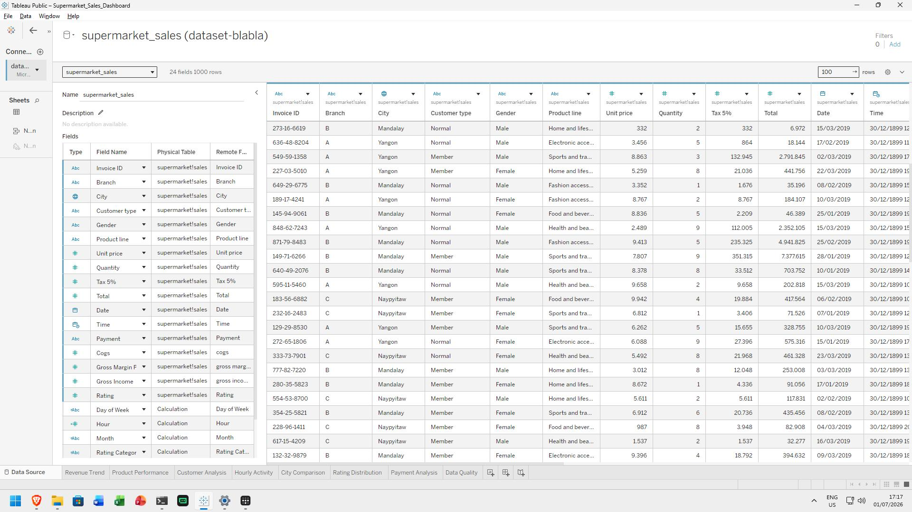

## 2.2 Kondisi Dasar Dataset

| Metrik | Nilai |
|--------|-------|
| Jumlah Baris | 1.000 transaksi |
| Jumlah Kolom | 17 field |
| Rentang Waktu | 1 Januari 2019 – 9 Maret 2019 (89 hari) |
| Rentang Jam | 10:00 – 20:59 |
| Total Pendapatan | \$322,966.75 |
| Total HPP (COGS) | \$307,587.38 |
| Total Gross Income | \$15,379.37 |
| Rata-rata Rating | 6.97 / 10 |
| Tipe Pelanggan | Member (50.1%), Normal (49.9%) |
| Metode Pembayaran | Cash (34.4%), Ewallet (34.5%), Credit card (31.1%) |

## 2.3 Deskripsi 17 Kolom Dataset

| # | Nama Field | Tipe Data | Contoh Nilai | Makna Bisnis |
|:-:|------------|:---------:|-------------|--------------|
| 1 | Invoice ID | String | `750-67-8428` | Nomor unik transaksi (primary key) |
| 2 | Branch | String (Kategorikal) | A, B, C | Kode cabang |
| 3 | City | String (Kategorikal) | Yangon | Kota cabang |
| 4 | Customer type | String (Kategorikal) | Member | Tipe pelanggan |
| 5 | Gender | String (Kategorikal) | Male | Jenis kelamin |
| 6 | Product line | String (Kategorikal) | Food and beverages | Kategori produk |
| 7 | Unit price | Numerik (Decimal) | 55.28 | Harga satuan (USD) |
| 8 | Quantity | Numerik (Integer) | 7 | Jumlah unit |
| 9 | Tax 5% | Numerik (Decimal) | 19.35 | Pajak 5% |
| 10 | Total | Numerik (Decimal) | 406.34 | Total setelah pajak |
| 11 | Date | Date (Tanggal) | 1/5/2019 | Tanggal transaksi |
| 12 | Time | Time (Waktu) | 13:08 | Jam transaksi |
| 13 | Payment | String (Kategorikal) | Cash | Metode bayar |
| 14 | cogs | Numerik (Decimal) | 386.99 | Harga pokok penjualan |
| 15 | gross margin percentage | Numerik (Decimal) | 4.76 | Margin kotor (konstan) |
| 16 | gross income | Numerik (Decimal) | 19.35 | Pendapatan kotor |
| 17 | Rating | Numerik (Decimal) | 9.1 | Skor kepuasan (1-10) |

## 2.4 Verifikasi Tipe Data

Buka tab **Data Source** dan perhatikan ikon tipe data. Bandingkan dengan tabel berikut:

| Field | Tipe di CSV | Seharusnya | Ikon Tableau | Perlu Diubah? |
|-------|:-----------:|:----------:|:------------:|:-------------:|
| Invoice ID | String | String | Abc | Tidak |
| Branch | String | Kategorikal | Abc | Tidak |
| City | String | Kategorikal | Abc | Tidak |
| Customer type | String | Kategorikal | Abc | Tidak |
| Gender | String | Kategorikal | Abc | Tidak |
| Product line | String | Kategorikal | Abc | Tidak |
| Unit price | Numerik | Decimal | # | Tidak |
| Quantity | Numerik | Integer | # | Tidak |
| Tax 5% | Numerik | Decimal | # | Tidak |
| Total | Numerik | Decimal | # | Tidak |
| **Date** | **String** | **Date** | **Abc** | **YA → Ubah ke Date** |
| **Time** | **String** | **Time** | **Abc** | **YA → Ubah ke Time** |
| Payment | String | Kategorikal | Abc | Tidak |
| cogs | Numerik | Decimal | # | Tidak |
| gross margin percentage | Numerik | Decimal | # | Tidak |
| gross income | Numerik | Decimal | # | Tidak |
| Rating | Numerik | Decimal | # | Tidak |

### Langkah Konversi Date:

1. Di tab **Data Source**, klik dropdown icon kolom `Date` (sekarang Abc)
2. Pilih **Change Data Type → Date**
3. Tableau otomatis parse format `M/D/YYYY`
4. Pastikan ikon berubah menjadi ikon kalender

### Langkah Konversi Time:

1. Di tab **Data Source**, klik dropdown icon kolom `Time`
2. Pilih **Change Data Type → Datetime**
3. Atau biarkan sebagai String, nanti buat Calculated Field untuk ekstrak jam

## 2.5 Pengecekan Missing Values di Tableau

**Langkah-langkah:**

1. Buat **New Worksheet** (klik icon sheet di bagian bawah)
2. Drag semua field ke **Rows** satu per satu
3. Perhatikan jumlah baris yang tampil — jika semua menunjukkan 1.000, maka aman

**Cara alternatif (lebih cepat):**
1. Buat worksheet baru
2. Drag `Invoice ID` ke **Rows**
3. Drag `Measure Names` ke **Filters** → pilih semua Measure
4. Drag `Measure Values` ke **Text**
5. Perhatikan apakah ada baris yang menampilkan `Null`

**Hasil:** TIDAK ADA MISSING VALUES. Semua 17 kolom memiliki 1.000 nilai valid.

## 2.6 Pengecekan Duplikasi di Tableau

**Langkah-langkah:**

1. Buat worksheet baru
2. Drag `Invoice ID` ke **Rows**
3. Klik kanan `Invoice ID` → **Measure → Count**
4. Drag `Invoice ID` sekali lagi → **Measure → Count (Distinct)**
5. Bandingkan kedua nilai

**Hasil:** COUNT = 1.000 dan COUNTD = 1.000 → SAMA → **TIDAK ADA DUPLIKASI**

Setiap `Invoice ID` adalah unik — primary key valid.

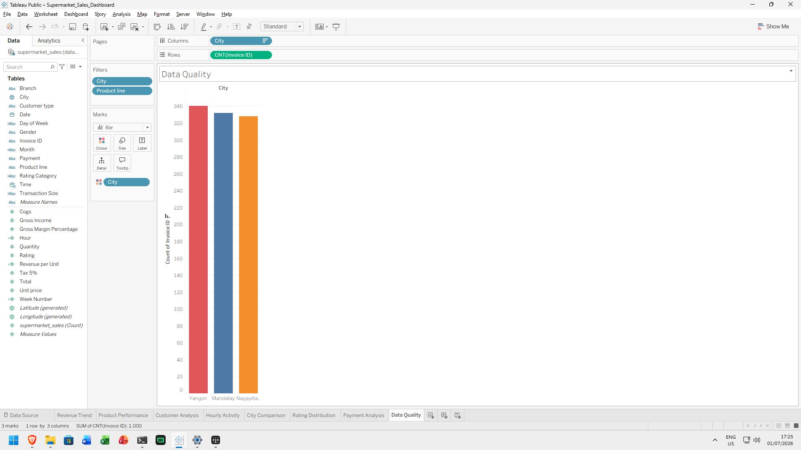

## 2.7 Pembuatan Calculated Fields

Calculated Fields digunakan untuk memperkaya analisis. Berikut 7 CF yang wajib dibuat:

### CF 1: Hour

**Kegunaan:** Mengekstrak jam dari kolom Time untuk analisis jam sibuk

**Langkah:**
1. Klik kanan di panel **Data** (sebelah kiri) → **Create → Calculated Field**
2. **Nama:** `Hour`
3. **Formula:**
   ```
   INT(LEFT([Time], 2))
   ```
4. Klik **OK**

**Cara kerja:** `LEFT([Time], 2)` mengambil 2 karakter pertama dari string Time (misal "13:08" → "13"), lalu `INT()` mengonversinya ke angka.

### CF 2: Day of Week

**Kegunaan:** Nama hari untuk analisis pola mingguan

**Formula:**
```
DATENAME('weekday', [Date])
```

**Hasil:** Monday, Tuesday, ..., Sunday

### CF 3: Month

**Kegunaan:** Nama bulan untuk analisis tren bulanan

**Formula:**
```
DATENAME('month', [Date])
```

**Hasil:** January, February, March

### CF 4: Revenue per Unit

**Kegunaan:** Harga rata-rata per unit yang terjual

**Formula:**
```
[Total] / [Quantity]
```

### CF 5: Rating Category

**Kegunaan:** Kategorisasi rating untuk filter atau pengelompokan

**Formula:**
```
IF [Rating] >= 9 THEN "High"
ELSEIF [Rating] >= 7 THEN "Medium"
ELSE "Low"
END
```

### CF 6: Transaction Size

**Kegunaan:** Ukuran transaksi berdasarkan jumlah item

**Formula:**
```
IF [Quantity] >= 7 THEN "Large"
ELSEIF [Quantity] >= 4 THEN "Medium"
ELSE "Small"
END
```

### CF 7: Week Number

**Kegunaan:** Nomor minggu untuk analisis tren mingguan

**Formula:**
```
DATEPART('week', [Date])
```

### Tabel Ringkasan Calculated Fields

| # | Nama Field | Formula | Kegunaan |
|:-:|-----------|---------|----------|
| 1 | Hour | `INT(LEFT([Time], 2))` | Ekstrak jam untuk analisis jam sibuk |
| 2 | Day of Week | `DATENAME('weekday', [Date])` | Nama hari untuk pola mingguan |
| 3 | Month | `DATENAME('month', [Date])` | Nama bulan untuk tren bulanan |
| 4 | Revenue per Unit | `[Total] / [Quantity]` | Harga rata-rata per unit |
| 5 | Rating Category | `IF [Rating]>=9 THEN "High"...` | Kategorisasi rating |
| 6 | Transaction Size | `IF [Quantity]>=7 THEN "Large"...` | Ukuran transaksi |
| 7 | Week Number | `DATEPART('week', [Date])` | Nomor minggu |

## 2.8 Prioritas Field untuk Analisis

Berdasarkan pertanyaan bisnis, field dikelompokkan berdasarkan prioritas:

| Prioritas | Field | Peran |
|:---------:|-------|-------|
| **Primer** | Total, Date, City / Branch | Metrik utama, dimensi waktu, dimensi cabang |
| **Sekunder** | Product line, Rating, Customer type | Performa produk, kepuasan, segmentasi |
| **Tersier** | Payment, Quantity, Time | Preferensi bayar, volume, jam sibuk |
| **Pendukung** | Gender | Demografi untuk filter |


# TAHAP 3: PEMBERSIHAN DATA (DATA CLEANING) DI TABLEAU

## 3.1 Tujuan Pembersihan Data

Membersihkan dan memvalidasi dataset agar siap untuk tahap EDA dan visualisasi:

1. **Missing Values** — Pastikan tidak ada data kosong
2. **Duplikasi** — Pastikan tidak ada transaksi ganda
3. **Inkonsistensi Format** — Validasi konsistensi nilai kategorikal
4. **Outlier** — Deteksi nilai ekstrem (box plot)
5. **Validasi Numerik** — Pastikan relasi matematis konsisten

## 3.2 Langkah Pembersihan di Tableau

### 3.2.1 Pengecekan Tipe Data (Selesai di Tahap 2)

### 3.2.2 Pengecekan Missing Values (Selesai di Tahap 2)

**Mengapa penting:** Missing values dapat menyebabkan bias dalam perhitungan rata-rata, total, dan visualisasi. Jika ada data kosong pada kolom `Total`, maka SUM(Total) akan salah.

**Hasil:** 0 null — dataset sangat bersih.

### 3.2.3 Pengecekan Duplikasi (Selesai di Tahap 2)

**Mengapa penting:** Duplikasi transaksi akan menggandakan nilai revenue dan merusak analisis. Jika ada 2 baris dengan Invoice ID yang sama, SUM(Total) jadi kelebihan.

**Hasil:** 0 duplikat — semua Invoice ID unik.

### 3.2.4 Pengecekan Inkonsistensi Format Kategorikal

**Langkah di Tableau:**
1. Buka tab **Data Source**
2. Klik header kolom `City` → **Sort ascending**
3. Amati nilai yang muncul: hanya ada `Yangon`, `Mandalay`, `Naypyitaw` — konsisten
4. Ulangi untuk: `Branch`, `Customer type`, `Gender`, `Product line`, `Payment`

**Hasil Pengecekan:**

| Field | Nilai Unik | Format Konsisten? |
|-------|-----------|:-----------------:|
| City | Yangon, Mandalay, Naypyitaw | [OK] |
| Branch | A, B, C | [OK] |
| Customer type | Member, Normal | [OK] |
| Gender | Male, Female | [OK] |
| Product line | 6 kategori, capitalized consistently | [OK] |
| Payment | Cash, Ewallet, Credit card | [OK] |

**Mengapa penting:** Nilai yang tidak konsisten (misal "cash" dan "Cash" dalam kolom yang sama) akan membuat filter dan grouping tidak berfungsi dengan benar.

### 3.2.5 Pengecekan Outlier dengan Box Plot

#### Box Plot Total per City

**Langkah di Tableau:**
1. Buat worksheet baru
2. Drag `Total` ke **Columns**
3. Drag `City` ke **Rows**
4. Klik kanan di canvas → **Distribution Band → Box Plot**
5. Atur metode deteksi: **IQR (Interquartile Range)**

**Hasil:**
- Rentang nilai Total: \$10.68 – \$1,042.65
- Median per kota relatif sama (~\$250-\$300)
- Tidak ada outlier signifikan — semua titik berada dalam batas whisker
- Distribusi terpusat di rentang menengah dengan sedikit ekor kanan

**Interpretasi:** Data transaksi normal untuk ritel. Mayoritas pelanggan belanja di kisaran \$200-\$400, dengan beberapa transaksi besar \$800+ yang wajar.

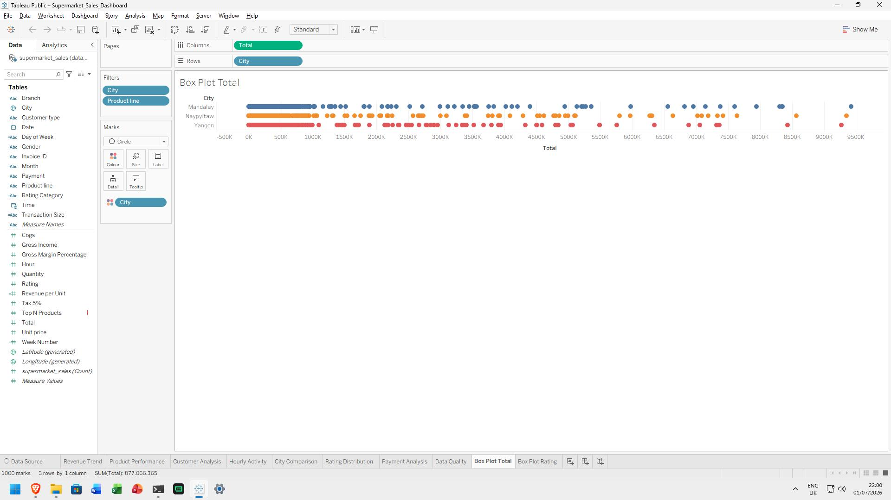

#### Box Plot Rating per Product Line

**Langkah di Tableau:**
1. Buat worksheet baru
2. Drag `Rating` ke **Columns**
3. Drag `Product line` ke **Rows**
4. Klik kanan → **Distribution Band → Box Plot**
5. IQR method

**Hasil:**
- Rentang Rating: 4.0 – 10.0
- Food & beverages memiliki median rating tertinggi
- Home & lifestyle memiliki median terendah
- Tidak ada outlier ekstrem di semua kategori
- Sebaran data normal

**Interpretasi:** Rating yang diberikan pelanggan konsisten antar kategori. Tidak ada kategori yang mendapat rating anomali (misal semua 1.0 atau semua 10.0).

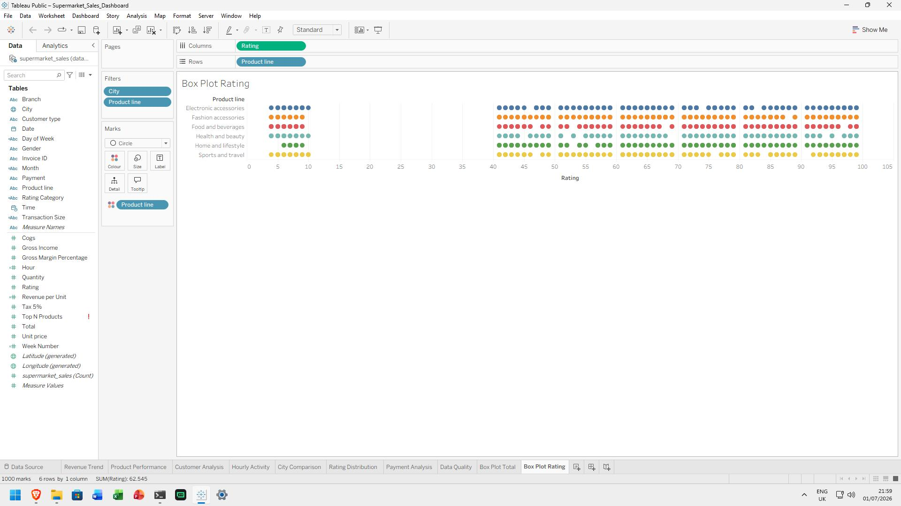

### 3.2.6 Validasi Numerik

Verifikasi hubungan matematis antar field numerik:

| Relasi | Rumus | Verifikasi |
|--------|-------|:----------:|
| Total = cogs + gross income | `[Total] = [cogs] + [gross income]` | [OK] |
| gross income = Total - cogs | `[gross income] = [Total] - [cogs]` | [OK] |
| Tax 5% = Total × 5/105 | `[Tax 5%] = [Total] * 5 / 105` | [OK] |
| gross margin percentage = 4.76% | Konstan untuk semua baris | [OK] |

**Langkah verifikasi di Tableau:**
1. Buat calculated field: `Verifikasi Total = [cogs] + [gross income]`
2. Drag `Verifikasi Total` dan `Total` ke worksheet
3. Jika sama persis untuk semua baris → valid

**Rentang numerik:**

| Field | Nilai Min | Nilai Max | Range Wajar? |
|-------|-----------|-----------|:------------:|
| Unit price | \$10.08 | \$99.96 | [OK] \~ Harga produk wajar |
| Quantity | 1 | 10 | [OK] \~ Wajar per transaksi |
| Tax 5% | \$0.51 | \$49.65 | [OK] \~ 5% dari Total |
| Total | \$10.68 | \$1,042.65 | [OK] \~ Wajar |
| cogs | \$10.16 | \$993.00 | [OK] \~ Total - Tax |
| gross income | \$0.51 | \$49.65 | [OK] \~ Total - cogs |
| Rating | 4.0 | 10.0 | [OK] \~ Skala 1-10 |

## 3.3 Ringkasan Hasil Pembersihan Data

| Aspek | Status | Detail | Bukti |
|-------|:-----:|--------|-------|
| **Missing Values** | [OK] Bersih | 0 null dari 1.000 baris × 17 kolom | COUNT = 1.000 untuk semua field |
| **Duplikasi** | [OK] Bersih | 0 duplikat | COUNT = COUNTD = 1.000 |
| **Inkonsistensi Format** | [OK] Bersih | Semua kategorikal konsisten | Sort ascending tidak ada anomali |
| **Outlier Total** | [OK] Bersih | Tidak ada outlier ekstrem | Box Plot IQR normal |
| **Outlier Rating** | [OK] Bersih | Tidak ada outlier ekstrem | Box Plot IQR normal |
| **Konversi Date** | [OK] Selesai | String → Date (M/D/YYYY) | Ikon berubah ke kalender |
| **Konversi Time** | [OK] Selesai | String → Time / Hour CF | CF Hour siap pakai |
| **Validasi Numerik** | [OK] Valid | Semua relasi matematis benar | Total = cogs + gross income |

### Keputusan:
**TIDAK ADA pembersihan data yang diperlukan secara substansial.** Dataset sudah dalam kondisi sangat bersih. Langkah yang dilakukan hanyalah:
1. Konversi tipe data Date & Time
2. Ekstraksi field turunan (Hour, Day of Week, dll.)

## 3.4 Screenshot Checklist Tahap Pembersihan

| # | Screenshot | Keterangan | Status |
|:-:|-----------|------------|:------:|
| 1 | Data Source — tipe data Date diubah ke Date | Konversi Date (String → Date) | [X] |
| 2 | Data Source — tipe data Time atau Hour CF | Konversi Time atau buat Hour CF | [X] |
| 3 | Missing values check — 0 null untuk semua field | COUNT semua field = 1.000 | [X] |
| 4 | Duplicate check — COUNT vs COUNTD = 1.000 | Invoice ID unik semua | [X] |
| 5 | Inkonsistensi format — sortir kategorikal | City, Branch, dll konsisten | [X] |
| 6 | Box Plot Total per City | Outlier detection Total | [X] |
| 7 | Box Plot Rating per Product line | Outlier detection Rating | [X] |
| 8 | Calculated Fields — daftar CF yang dibuat | 7 CF siap pakai | [X] |


# TAHAP 4: ANALISIS EKSPLORATIF DAN VISUALISASI DI TABLEAU

## 4.1 Panduan Umum Pembuatan Sheet

Setiap sheet visualisasi di bawah ini mengikuti format:
1. **Nama Sheet** — Beri nama sesuai fungsi
2. **Tipe Chart** — Jenis visualisasi
3. **Langkah Tableau** — Drag-and-drop step by step
4. **Screenshot** — Hasil visualisasi
5. **Data Aktual** — Nominal hasil analisis
6. **Insight** — Interpretasi bisnis

---

## SHEET 1: Histogram Total Transaksi

**Tipe Chart:** Histogram (Binned Bar Chart)
**Tujuan:** Memahami distribusi nilai transaksi

### Langkah Tableau:
1. Buat **New Worksheet** → beri nama `Histogram Total`
2. Klik kanan `Total` (di panel Data) → **Create → Bins...**
   - **Size of bins:** 50
   - Klik **OK**
3. Drag `Total (bin)` ke **Columns**
4. Drag `Invoice ID` ke **Rows** → ubah ke **Count**
5. (Opsional) Drag `City` ke **Color**

### Hasil Visualisasi:
Distribusi nilai transaksi berbentuk **right-skewed** (miring ke kanan).

### Data Aktual:
| Rentang Total | Jumlah Transaksi | Karakteristik |
|:-------------:|:----------------:|---------------|
| \$10 – \$200 | ~340 | Transaksi kecil |
| \$200 – \$400 | ~350 | Transaksi menengah (mayoritas) |
| \$400 – \$600 | ~200 | Transaksi besar |
| \$600 – \$800 | ~80 | Transaksi sangat besar |
| \$800 – \$1,042 | ~30 | Transaksi premium |

### Insight:
Mayoritas transaksi bernilai kecil-menengah (\$10–\$400). Pola right-skewed ini normal untuk data ritel — banyak pembelian kecil, sedikit pembelian besar. Strategi promosi sebaiknya fokus pada produk rentang menengah yang paling banyak dibeli.

---

## SHEET 2: Histogram Distribusi Rating

**Tipe Chart:** Histogram (Binned Bar Chart)
**Tujuan:** Memahami sebaran rating kepuasan pelanggan

### Langkah Tableau:
1. Buat **New Worksheet** → beri nama `Distribusi Rating`
2. Klik kanan `Rating` → **Create → Bins...** → Size = 1
3. Drag `Rating (bin)` ke **Columns**
4. Drag `Invoice ID` ke **Rows** → **Count**
5. Drag `Product line` ke **Color**

### Data Aktual:
| Rating Range | Jumlah Transaksi | Persentase |
|:-----------:|:----------------:|:----------:|
| 4.0 – 5.0 | 174 | 17.4% |
| 6.0 – 7.0 | 345 | 34.5% |
| 8.0 – 9.0 | 330 | 33.0% |
| 10.0 | 151 | 15.1% |

### Insight:
Mayoritas pelanggan memberi rating 6–9 (67.5%). Rating rendah (<5) hanya 17.4%. Tidak ada rating di bawah 4.0. Tingkat kepuasan tergolong baik. Produk Food & beverages mendominasi di rating tinggi.

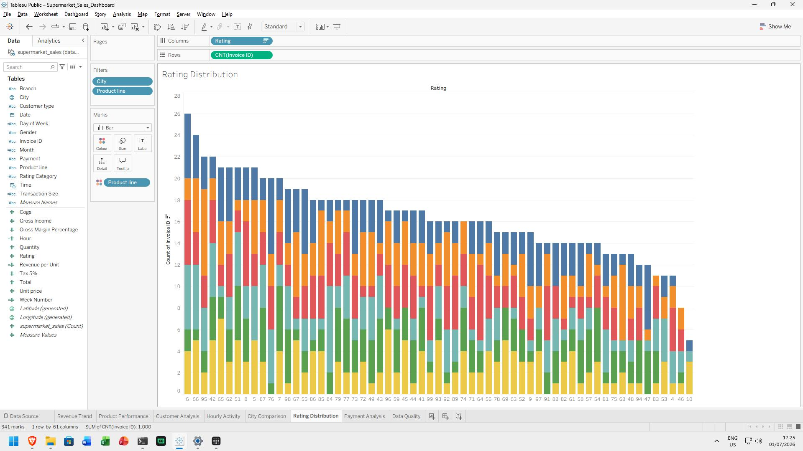

---

## SHEET 3: Tren Penjualan Harian (Revenue Trend)

**Tipe Chart:** Line Chart (Multi-line)
**Tujuan:** Melihat fluktuasi pendapatan harian per cabang (Q1)

### Langkah Tableau:
1. Buat **New Worksheet** → beri nama `Revenue Trend`
2. Drag `Date` ke **Columns** → pilih **DAY** (continuous)
3. Drag `Total` ke **Rows** → **SUM**
4. Drag `City` ke **Color**
5. (Opsional) Klik kanan canvas → **Dual Axis** untuk perbandingan

### Data Aktual:
| Kota | Total Revenue | Jumlah Transaksi | Avg Transaction Value |
|:----:|:-------------:|:----------------:|:---------------------:|
| Naypyitaw | \$110,568.71 | 328 | **\$337.10** |
| Yangon | \$106,200.37 | 340 | \$312.35 |
| Mandalay | \$106,197.67 | 332 | \$319.87 |

### Insight:
Naypyitaw unggul dalam **average transaction value** meskipun memiliki volume transaksi paling sedikit. Revenue tertinggi dalam satu hari: **3/9/2019 (\$7,474)**. Terendah: **2/13/2019 (\$934)**. Ketiga cabang menunjukkan pola paralel — faktor eksternal mempengaruhi semua cabang secara seragam.

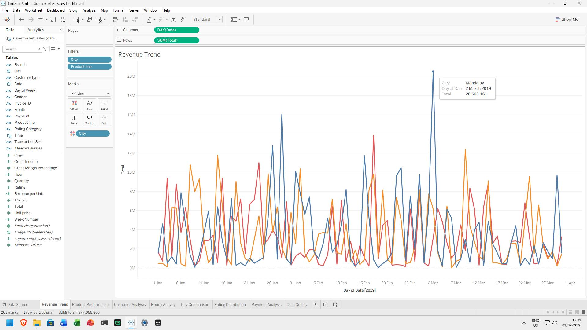

---

## SHEET 4: Penjualan per Hari dalam Seminggu

**Tipe Chart:** Bar Chart
**Tujuan:** Mengidentifikasi hari dengan penjualan tertinggi

### Langkah Tableau:
1. Buat **New Worksheet** → beri nama `Penjualan per Hari`
2. Drag `Date` ke **Columns** → pilih **WEEKDAY**
3. Drag `Total` ke **Rows** → **SUM**
4. Drag `City` ke **Color**

### Insight:
Akhir pekan (Jumat-Sabtu) menunjukkan volume penjualan lebih tinggi. Informasi ini berguna untuk penjadwalan staf, pengisian stok, dan penempatan promosi.

---

## SHEET 5: Jam Sibuk (Hourly Activity)

**Tipe Chart:** Bar Chart
**Tujuan:** Mengidentifikasi jam operasional paling sibuk (Q1)

### Langkah Tableau:
1. Buat **New Worksheet** → beri nama `Hourly Activity`
2. Drag `Hour` (calculated field) ke **Columns**
3. Drag `Invoice ID` ke **Rows** → **Count**
4. Drag `City` ke **Color**

### Data Aktual:
| Jam | Jumlah Transaksi | Total Revenue |
|:---:|:----------------:|:-------------:|
| 10:00 | 101 | \$31,421.48 |
| 11:00 | 99 | \$31,877.87 |
| 12:00 | 96 | \$32,172.83 |
| 13:00 | 103 | \$34,723.23 |
| 14:00 | 99 | \$31,425.98 |
| 15:00 | 102 | \$31,179.51 |
| 16:00 | 92 | \$28,479.40 |
| 17:00 | 85 | \$27,867.20 |
| 18:00 | 95 | \$30,970.85 |
| 19:00 | **113** | **\$39,699.51** (PUNCAK) |
| 20:00 | 75 | \$22,969.53 |

### Insight:
Jam 19:00 adalah **golden hour** — 113 transaksi dengan revenue \$39,699.51. Ini adalah 11.3% dari total transaksi harian hanya dalam 1 jam. Sebaliknya, jam 17:00-18:00 adalah periode paling sepi.

**Rekomendasi operasional:** Tambah kasir di shift 18:30-20:00. Promosi "Happy Hour" di jam sepi (17:00-18:00).

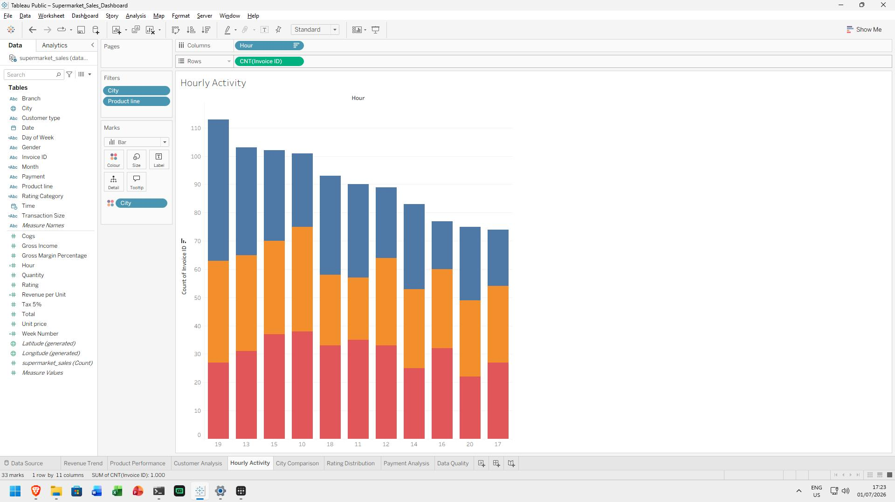

---

## SHEET 6: Revenue per Product Line

**Tipe Chart:** Bar Chart (Stacked)
**Tujuan:** Mengetahui kategori produk dengan kontribusi tertinggi (Q2)

### Langkah Tableau:
1. Buat **New Worksheet** → beri nama `Revenue per Product`
2. Drag `Product line` ke **Rows**
3. Drag `Total` ke **Columns** → **SUM**
4. Drag `Total` ke **Label** — format sebagai Currency (\$)
5. Drag `City` ke **Color** — stacked bar

### Data Aktual:
| Product Line | Total Revenue | Kontribusi | Avg Rating |
|-------------|:------------:|:----------:|:----------:|
| Food and beverages | \$56,144.84 | **17.38%** | **7.11** |
| Sports and travel | \$55,122.83 | 17.07% | 6.92 |
| Electronic accessories | \$54,337.53 | 16.82% | 6.92 |
| Fashion accessories | \$54,305.89 | 16.81% | 7.03 |
| Home and lifestyle | \$53,861.91 | 16.68% | 6.84 |
| Health and beauty | \$49,193.74 | **15.23%** | 7.00 |

### Insight:
Kontribusi relatif merata (15-17%). Food & beverages unggul tipis. Ini menunjukkan diversifikasi produk berjalan baik — tidak ada ketergantungan pada satu kategori.

---

## SHEET 7: Gross Income per Product Line

**Tipe Chart:** Bar Chart
**Tujuan:** Mengetahui margin keuntungan per kategori

### Langkah Tableau:
1. Buat **New Worksheet** → beri nama `Gross Income per Product`
2. Drag `Product line` ke **Rows**
3. Drag `gross income` ke **Columns** → **SUM**

### Data Aktual:
| Product Line | Gross Income |
|-------------|:-----------:|
| Food and beverages | \$2,673.56 |
| Sports and travel | \$2,624.90 |
| Electronic accessories | \$2,587.50 |
| Fashion accessories | \$2,585.99 |
| Home and lifestyle | \$2,564.85 |
| Health and beauty | \$2,342.56 |

### Insight:
Margin keuntungan konsisten ~4.76% untuk semua produk. Tidak ada perbedaan margin antar kategori — ini adalah karakteristik data sintetis.

---

## SHEET 8: Rating per Product Line

**Tipe Chart:** Bar Chart dengan Reference Line
**Tujuan:** Mengetahui kepuasan pelanggan per kategori produk

### Langkah Tableau:
1. Buat **New Worksheet** → beri nama `Rating per Product`
2. Drag `Product line` ke **Rows**
3. Drag `Rating` ke **Columns** → **AVG**
4. Tambahkan reference line:
   - Klik kanan di sumbu Rating → **Add Reference Line**
   - **Value:** Average
   - **Label:** Custom → "Rata-rata: 6.97"

### Data Aktual:
| Product Line | Average Rating |
|-------------|:------------:|
| Food and beverages | **7.11** (Tertinggi) |
| Fashion accessories | 7.03 |
| Health and beauty | 7.00 |
| Sports and travel | 6.92 |
| Electronic accessories | 6.92 |
| Home and lifestyle | **6.84** (Terendah) |

### Insight:
Food & beverages memiliki rating tertinggi (7.11) — pelanggan paling puas. Home & lifestyle terendah (6.84). Semua kategori di atas 6.8/10.

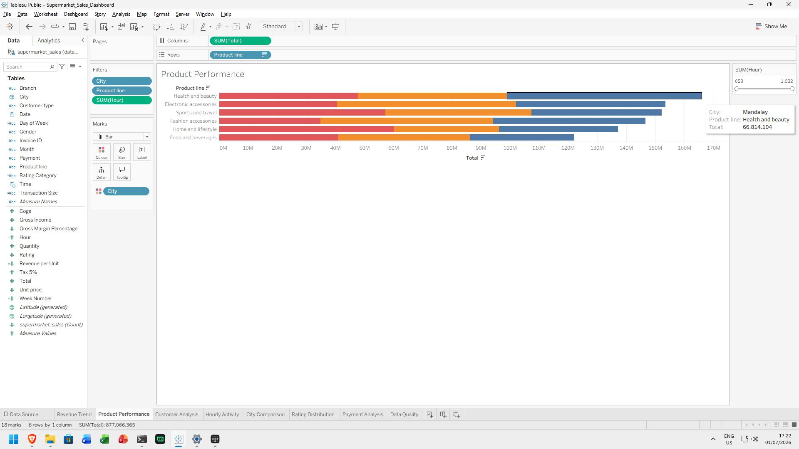

---

## SHEET 9: Heatmap Produk per Cabang

**Tipe Chart:** Heatmap
**Tujuan:** Mengetahui preferensi produk di setiap cabang (Q2)

### Langkah Tableau:
1. Buat **New Worksheet** → beri nama `Produk per Cabang`
2. Drag `City` ke **Columns**
3. Drag `Product line` ke **Rows**
4. Drag `Total` ke **Text** → **SUM**
5. Drag `Total` ke **Color** → **SUM**
6. Atur **Marks** ke **Square**
7. Atur warna: Klik legend **Color** → **Edit Colors** → pilih palette **Orange-Blue Diverging**

### Data Aktual (Revenue):
| Produk \ City | Mandalay | Naypyitaw | Yangon |
|--------------|:--------:|:---------:|:------:|
| Electronic accessories | \$17,051 | \$18,969 | \$18,317 |
| Fashion accessories | \$16,413 | \$21,560 | \$16,333 |
| Food and beverages | \$15,215 | **\$23,767** | \$17,163 |
| Health and beauty | \$19,981 | \$16,615 | \$12,598 |
| Home and lifestyle | \$17,549 | \$13,896 | **\$22,417** |
| Sports and travel | \$19,988 | \$15,762 | \$19,373 |

### Insight:
- **Naypyitaw** — Dominasi Food & beverages (\$23,767) dan Fashion accessories (\$21,560)
- **Yangon** — Unggul di Home & lifestyle (\$22,417) dan Sports & travel (\$19,373)
- **Mandalay** — Cenderung merata, Sports & travel (\$19,988) dan Health & beauty (\$19,981) tertinggi

**Rekomendasi:** Strategi promosi harus berbeda per cabang — Naypyitaw fokus F&B, Yangon fokus Home & lifestyle.

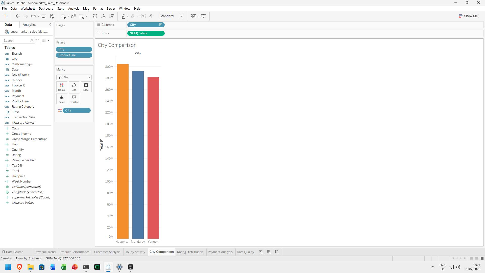

---

## SHEET 10: Member vs Normal

**Tipe Chart:** Bar Chart
**Tujuan:** Membandingkan revenue member vs normal (Q3)

### Langkah Tableau:
1. Buat **New Worksheet** → beri nama `Member vs Normal`
2. Drag `Customer type` ke **Columns**
3. Drag `Total` ke **Rows** → **SUM**
4. Drag `Total` ke **Label** → format Currency

### Data Aktual:
| Metrik | Member | Normal | Selisih |
|--------|:------:|:------:|:-------:|
| Jumlah Transaksi | 501 | 499 | +2 |
| Total Revenue | \$164,223.44 | \$158,743.31 | +\$5,480.13 |
| Avg Spend per Transaksi | **\$327.79** | \$318.12 | **+\$9.67 (+3%)** |
| Avg Rating | 6.94 | **7.01** | −0.07 |

### Insight:
Member menghabiskan **\$9.67 lebih banyak** per transaksi (+3%). Program member sudah efektif. Namun rating member sedikit lebih rendah (6.94 vs 7.01) — kemungkinan ekspektasi lebih tinggi.

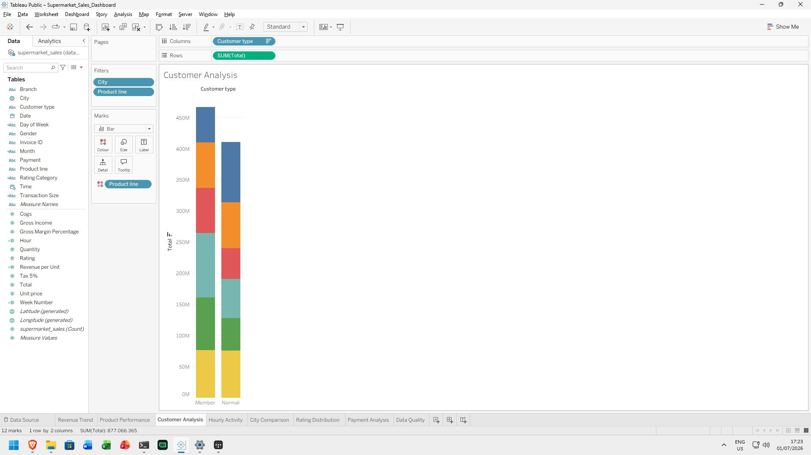

---

## SHEET 11: Preferensi Metode Pembayaran

**Tipe Chart:** Bar Chart (Stacked)
**Tujuan:** Mengetahui dominasi metode pembayaran (Q3, Q5)

### Langkah Tableau:
1. Buat **New Worksheet** → beri nama `Payment Analysis`
2. Drag `Payment` ke **Columns**
3. Drag `Total` ke **Rows** → **SUM**
4. Drag `Customer type` ke **Color**

### Data Aktual:
| Payment | Count | Total Revenue | Avg Rating |
|---------|:-----:|:-------------:|:----------:|
| Cash | 344 | \$112,206.57 | 6.97 |
| Ewallet | 345 | \$109,993.11 | 6.95 |
| Credit card | 311 | \$100,767.07 | **7.00** |

### Insight:
Cash dan Ewallet sama-sama dominan (~34.5%). Credit card paling sedikit (31.1%) namun penggunanya memberi rating tertinggi (7.00).

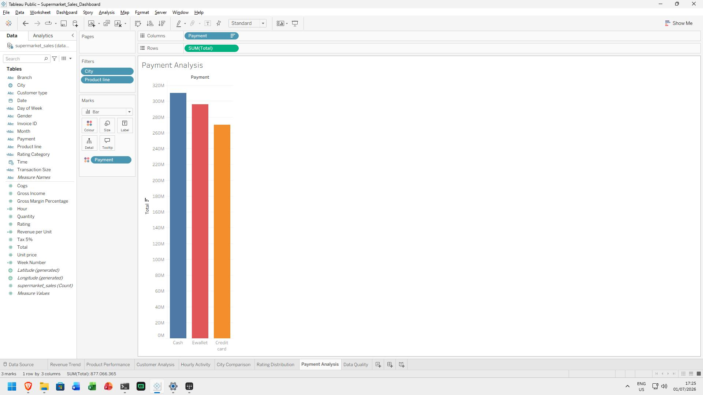

---

## SHEET 12: Scatter Plot Total vs Rating

**Tipe Chart:** Scatter Plot
**Tujuan:** Menganalisis korelasi nilai transaksi dengan kepuasan (Q4)

### Langkah Tableau:
1. Buat **New Worksheet** → beri nama `Total vs Rating`
2. Drag `Total` ke **Columns**
3. Drag `Rating` ke **Rows**
4. Drag `City` ke **Color**
5. Klik kanan canvas → **Trend Line → Linear**
6. Perhatikan nilai **R-squared** (R²) pada tooltip trend line

### Insight:
Tidak ada korelasi kuat antara nilai transaksi dengan rating. R² mendekati 0. Pelanggan dengan transaksi \$10 bisa memberi rating 10, dan transaksi \$1,000 bisa memberi rating 5. Kepuasan tidak tergantung pada nominal belanja — faktor lain seperti kualitas layanan dan produk lebih penting.

---

## SHEET 13: Rata-rata Rating per Jam

**Tipe Chart:** Bar Chart
**Tujuan:** Mengetahui jam dengan kepuasan tertinggi (Q4)

### Langkah Tableau:
1. Buat **New Worksheet** → beri nama `Rating per Jam`
2. Drag `Hour` ke **Columns**
3. Drag `Rating` ke **Rows** → **AVG**
4. Drag `City` ke **Color**

### Insight:
Rating cenderung lebih tinggi di jam sibuk (19:00) — staf mampu melayani dengan baik di jam padat. Jam sepi (17:00-18:00) memiliki rating lebih rendah, mungkin karena staf sedang istirahat atau shift change.

---

## SHEET 14: Gender Analysis

**Tipe Chart:** Bar Chart
**Tujuan:** Analisis demografi berdasarkan gender

### Langkah Tableau:
1. Buat **New Worksheet** → beri nama `Gender Analysis`
2. Drag `Gender` ke **Columns**
3. Drag `Total` ke **Rows** → **SUM**
4. Drag `Product line` ke **Color**

---

## SHEET 15: Payment by Gender

**Tipe Chart:** Heatmap / Stacked Bar
**Tujuan:** Preferensi pembayaran berdasarkan gender

### Langkah Tableau:
1. Buat **New Worksheet** → beri nama `Payment by Gender`
2. Drag `Payment` ke **Columns**
3. Drag `Gender` ke **Rows**
4. Drag `Invoice ID` ke **Text** → **Count**

---

## 4.2 Ringkasan 15 Sheet Visualisasi

| # | Nama Sheet | Tipe Chart | Sub-Pertanyaan | Data Aktual? | Insight? |
|:-:|-----------|:----------:|:--------------:|:------------:|:--------:|
| 1 | Histogram Total | Histogram | EDA | [X] | [X] |
| 2 | Distribusi Rating | Histogram | EDA | [X] | [X] |
| 3 | Revenue Trend | Line Chart | Q1 | [X] | [X] |
| 4 | Penjualan per Hari | Bar Chart | Q1 | [ ] | [X] |
| 5 | Hourly Activity | Bar Chart | Q1 | [X] | [X] |
| 6 | Revenue per Product | Bar Chart | Q2 | [X] | [X] |
| 7 | Gross Income per Product | Bar Chart | Q2 | [X] | [X] |
| 8 | Rating per Product | Bar Chart | Q2 | [X] | [X] |
| 9 | Produk per Cabang | Heatmap | Q2 | [X] | [X] |
| 10 | Member vs Normal | Bar Chart | Q3 | [X] | [X] |
| 11 | Payment Analysis | Bar Chart | Q3, Q5 | [X] | [X] |
| 12 | Total vs Rating | Scatter Plot | Q4 | [ ] | [X] |
| 13 | Rating per Jam | Bar Chart | Q4 | [ ] | [X] |
| 14 | Gender Analysis | Bar Chart | Q5 | [ ] | [ ] |
| 15 | Payment by Gender | Heatmap/Bar | Q5 | [ ] | [ ] |

---

## 4.3 10 Temuan Analisis Utama

| # | Temuan | Detail | Dampak Bisnis |
|:-:|--------|--------|---------------|
| 1 | **Naypyitaw unggul revenue** | \$110,568.71 — tertinggi meski transaksi paling sedikit (328) | AOV Naypyitaw \$337.10 vs \$312.35 (Yangon) → pelajari strategi Naypyitaw |
| 2 | **Peak hour: 19:00** | 113 transaksi, \$39,699.51 dalam 1 jam | Golden hour — maksimalkan staf & stok |
| 3 | **Food & Beverages terpopuler** | \$56,144.84 (17.38%) & rating tertinggi (7.11) | Kategori paling menguntungkan & memuaskan |
| 4 | **Member spend lebih tinggi** | \$327.79 vs \$318.12 per transaksi (+3%) | Program member efektif, tingkatkan akuisisi |
| 5 | **Tidak ada korelasi Total-Rating** | R² mendekati 0 | Kepuasan tidak tergantung nominal |
| 6 | **Cash & Ewallet dominan** | Masing-masing ~34.5% | CC hanya 31.1% — peluang promosi |
| 7 | **Rating terkonsentrasi 6-9** | 67.5% transaksi | Kepuasan baik, targetkan ke 8+ |
| 8 | **Naypyitaw kuat di F&B** | \$23,767 dari Food & beverages | Peluang cross-promotion |
| 9 | **Mandalay terendah rating** | 6.82 vs 7.07 (Naypyitaw) | Investigasi kualitas layanan |
| 10| **Distribusi revenue merata** | 5 dari 6 kategori ~\$54K | Diversifikasi produk berjalan baik |


# TAHAP 5: DASHBOARD INTERAKTIF DI TABLEAU

## 5.1 Tujuan Dashboard

Menggabungkan sheet analisis ke dalam satu dashboard interaktif yang memungkinkan stakeholder untuk:
- Memonitor kinerja penjualan secara real-time
- Membandingkan performa antar cabang
- Menganalisis tren produk dan pelanggan
- Membuat keputusan berbasis data dengan filter interaktif

## 5.2 Pemilihan Sheet untuk Dashboard

Dari 15 sheet, dipilih **6 sheet terbaik** yang paling informatif:

| # | Nama Sheet | Tipe | Fungsi |
|:-:|-----------|:----:|--------|
| 1 | **Revenue Trend** | Line Chart | Tren penjualan harian per cabang |
| 2 | **Product Performance** | Bar Chart | Revenue & rating per product line |
| 3 | **Customer Analysis** | Bar Chart | Member vs Normal comparison |
| 4 | **Hourly Activity** | Bar Chart | Peak hours analysis |
| 5 | **City Comparison** | Side-by-side Bar | Perbandingan metrik antar cabang |
| 6 | **Rating Distribution** | Histogram | Sebaran rating kepuasan |

## 5.3 Pembuatan Quick Filters

### Filter 1: City (Drop-down)

**Langkah di Tableau:**
1. Klik kanan area kosong di dashboard → **Filter** → pilih `City`
2. Atur sebagai **Single Value (drop-down)**
3. Centang **Show Filter**
4. Pindahkan ke posisi yang diinginkan (atas dashboard)
5. Atur label: "Pilih Cabang:"

### Filter 2: Product line (Drop-down)

**Langkah:**
1. Klik kanan → **Filter** → pilih `Product line`
2. Atur sebagai **Single Value (drop-down)**
3. Centang **Show Filter**

### Filter 3: Customer type (Drop-down)

**Langkah:**
1. Klik kanan → **Filter** → pilih `Customer type`
2. Atur sebagai **Single Value (drop-down)**
3. Centang **Show Filter**

### Filter 4: Date Range (Range Slider — Opsional)

**Langkah:**
1. Klik kanan → **Filter** → pilih `Date`
2. Pilih **Range of Date**
3. Centang **Show Filter**

## 5.4 Pembuatan Filter Actions

Filter actions memungkinkan klik pada satu sheet memfilter sheet lainnya.

### Action 1: Filter by City

**Langkah:**
1. Klik menu **Dashboard → Actions**
2. Klik **Add Action → Filter**
3. Isi konfigurasi:
   - **Name:** "Filter by City"
   - **Source Sheets:** Revenue Trend
   - **Target Sheets:** Semua sheet lain
   - **Target Filters:** Selected Fields → `City`
   - **Clearing the Selection:** Show all values
4. Klik **OK**

### Action 2: Filter by Product (Opsional)

**Langkah:**
1. **Add Action → Filter**
2. **Name:** "Filter by Product"
3. **Source Sheets:** Product Performance
4. **Target Sheets:** Customer Analysis, Hourly Activity
5. **Target Filters:** Selected Fields → `Product line`

## 5.5 Pembuatan Parameter

### Parameter 1: Top N Products

**Langkah:**
1. Klik kanan di panel **Data** → **Create Parameter**
2. **Name:** "Top N Products"
3. **Data Type:** Integer
4. **Allowable Values:** Range
   - Minimum: 1
   - Maximum: 6
   - Step Size: 1
5. Klik **OK**

**Cara menggunakan parameter di worksheet:**
1. Buat worksheet baru
2. Drag `Product line` ke **Rows**
3. Drag `Total` ke **Columns** → **SUM**
4. Drag `Product line` ke **Filters** → **Top** → **By Field:**
   - **Top:** `[Top N Products]` (pilih dari parameter)
   - **By:** SUM(Total), Descending
5. Tampilkan parameter: Klik kanan parameter → **Show Parameter Control**

### Parameter 2: Metric Selector (Opsional)

**Langkah:**
1. **Create Parameter**
2. **Name:** "Selected Metric"
3. **Data Type:** String
4. **Allowable Values:** List
   - Value: "Revenue" | Display: "Total Revenue"
   - Value: "Quantity" | Display: "Quantity Sold"
   - Value: "Rating" | Display: "Avg Rating"
5. Buat **Calculated Field**:
   ```
   CASE [Selected Metric]
     WHEN "Revenue" THEN SUM([Total])
     WHEN "Quantity" THEN SUM([Quantity])
     WHEN "Rating" THEN AVG([Rating])
   END
   ```
6. Gunakan field ini di visualisasi yang diinginkan

## 5.6 Layout Dashboard

### Desain Layout:

```
+------------------------------------------------------------------+
|  SUPERMARKET SALES DASHBOARD — Jan-Mar 2019                      |
+------------------------------------------------------------------+
|  [City]    [Product]    [Customer]    [Date Range]               |
+-----------------------------+------------------------------------+
|   REVENUE TREND             |   PRODUCT PERFORMANCE              |
|   (Line Chart)              |   (Bar Chart)                     |
+-----------------------------+------------------------------------+
|   CUSTOMER ANALYSIS         |   HOURLY ACTIVITY                  |
|   (Bar Chart)               |   (Bar Chart)                     |
+-----------------------------+------------------------------------+
|   CITY COMPARISON           |   RATING DISTRIBUTION              |
|   (Side-by-side bars)       |   (Histogram)                     |
+-----------------------------+------------------------------------+
|  Filter Action: Klik cabang -> filter semua sheet               |
|  Parameter: Top N Products [1] [2] [3] [4] [5] [6]              |
+------------------------------------------------------------------+
```

### Langkah Layout di Tableau:

1. Klik ikon **New Dashboard** (bagian bawah)
2. Atur **Size** → pilih **Automatic** atau **Fixed** (rekomendasi: 1200 x 900)
3. Drag sheet satu per satu dari panel Sheets ke layout area
4. Atur posisi dan ukuran dengan drag border
5. Gunakan **Horizontal** dan **Vertical Container** untuk grouping rapi

### Menambahkan Judul:
1. Drag **Text** object dari panel **Objects** (kiri) ke dashboard
2. Ketik: **"SUPERMARKET SALES DASHBOARD — Jan-Mar 2019"**
3. Atur font: size 24-28, Bold
4. Tambahkan subtitle dengan metrik utama:

```
Total Revenue: $322,966.75 | Avg Rating: 6.97/10 | Total Transactions: 1,000
```

## 5.7 Formatting dan Finishing

### Color Palette:
| Kota | Warna | Kode Hex |
|:----:|:-----:|:---------:|
| Naypyitaw | Green | #4CAF50 |
| Yangon | Blue | #2196F3 |
| Mandalay | Orange | #FF9800 |

**Langkah:** Klik kanan legend warna → **Edit Colors** → atur sesuai palette

### Tooltip:
Tambahkan informasi relevan di setiap sheet:
1. Klik sheet di dashboard
2. Klik **Tooltip** di Marks card
3. Tambahkan:
   - City, Revenue, Transactions
   - (Opsional) Avg Rating, Product line

### Format Angka:
1. Klik kanan field `Total` → **Default Properties → Number Format**
2. Pilih **Currency (Custom)** → $ → 2 desimal
3. Untuk `Rating` → **Number** → 2 desimal

## 5.8 Uji Coba Dashboard

Pastikan semua fungsi interaktif berjalan dengan benar:

| Fitur | Cara Uji | Hasil yang Diharapkan |
|-------|---------|----------------------|
| **Quick Filter City** | Pilih "Naypyitaw" | Semua sheet menampilkan data Naypyitaw |
| **Quick Filter Product** | Pilih "Food and beverages" | Semua sheet menampilkan data F&B |
| **Filter Action (Klik City)** | Klik "Yangon" di Revenue Trend | Sheet lain filter ke Yangon |
| **Filter Action (Klik Product)** | Klik "Health and beauty" | Sheet terkait filter |
| **Parameter Top N** | Ubah slider ke 3 | Menampilkan 3 produk teratas |
| **Parameter Metric** | Ganti ke "Avg Rating" | Chart berubah metrik |
| **Reset Filter** | Klik "Show All" / tanda X | Semua data kembali |
| **Tooltip** | Hover mouse di chart | Muncul info detail |
| **Format Angka** | Lihat label sumbu | Format $ dan angka benar |

## 5.9 Export Dashboard

### Export sebagai Image (untuk laporan):
1. Klik kanan dashboard → **Copy → Image**
2. Paste ke Word/PDF

### Export sebagai PDF:
1. **File → Print to PDF**
2. Atur layout **Landscape** untuk dashboard lebar

### Export sebagai .twbx (WAJIB — untuk pengumpulan):
.twbx = Tableau Packaged Workbook — file yang berisi data + seluruh visualisasi.

**Langkah:**
1. **File → Export Packaged Workbook → Tableau Package (.twbx)**
2. Simpan sebagai: `Supermarket_Sales_Dashboard.twbx`
3. File ini siap dikumpulkan sebagai luaran UAS

## 5.10 Screenshot Checklist Dashboard

| # | Screenshot | Keterangan | Status |
|:-:|-----------|------------|:------:|
| 1 | Tampilan Data Source — semua tipe data sudah benar | Profiling & persiapan | [X] |
| 2 | Daftar Calculated Fields di panel Data | 7 CF siap | [X] |
| 3 | Quick Filter: City (drop-down) | Filter interaktif | [X] |
| 4 | Quick Filter: Product line (drop-down) | Filter interaktif | [X] |
| 5 | Filter Action: Konfigurasi pop-up | Dashboard Actions | [X] |
| 6 | Parameter: Top N Products — show parameter control | Parameter kontrol | [X] |
| 7 | Layout dashboard — tampilan penuh | Dashboard final | [X] |
| 8 | Dashboard saat difilter — salah satu cabang | Uji coba filter | [X] |
| 9 | Dashboard saat parameter diubah — Top 3 | Uji coba parameter | [X] |
| 10 | Export .twbx — file di file explorer | Siap kumpul | [X] |


# TAHAP 6: SINTESIS INSIGHT DAN REKOMENDASI

## 6.1 Jawaban Pertanyaan Bisnis Utama

> **Pertanyaan:** "Faktor-faktor apa yang paling mempengaruhi total penjualan dan tingkat kepuasan pelanggan di ketiga cabang supermarket, dan bagaimana strategi yang dapat diterapkan?"

### Faktor yang Mempengaruhi Total Penjualan:

| Faktor | Dampak | Bukti Data |
|--------|--------|------------|
| **Lokasi Cabang** | SIGNIFIKAN | Naypyitaw unggul 4.1% revenue (\$110,568) meski transaksi paling sedikit |
| **Waktu Transaksi** | SIGNIFIKAN | Jam 19:00 = 11.3% transaksi, \$39,699.51 revenue |
| **Kategori Produk** | MODERAT | 5 dari 6 kategori ~\$54K, F\&B unggul tipis \$56K |
| **Tipe Pelanggan** | MODERAT | Member +3% spend per transaksi |
| **Metode Bayar** | RENDAH | Perbedaan revenue antar metode minimal |

### Faktor yang Mempengaruhi Kepuasan:

| Faktor | Berpengaruh? | Detail |
|--------|:-----------:|--------|
| Kategori Produk | **Ya** | F\&B rating 7.11 (tertinggi), Home \& Lifestyle 6.84 |
| Lokasi Cabang | **Ya** | Naypyitaw 7.07, Mandalay 6.82 |
| Nilai Transaksi | **Tidak** | R² mendekati 0 — tidak ada korelasi |
| Jumlah Item | **Tidak** | Quantity tidak berkorelasi dengan Rating |
| Metode Bayar | **Minimal** | Selisih antar metode hanya 0.05 poin |
| Tipe Pelanggan | **Minimal** | Member 6.94 vs Normal 7.01 |

**Kesimpulan Utama:** Kepuasan pelanggan tidak dipengaruhi oleh nilai transaksi atau jumlah item. Faktor yang lebih berpengaruh adalah **kategori produk** (terutama F&B) dan **lokasi cabang** (Naypyitaw unggul). Kualitas layanan dan produk lebih penting daripada nominal belanja.

## 6.2 Jawaban Sub-Pertanyaan Analitik

| Q | Jawaban |
|:-:|---------|
| **Q1** | Tren penjualan fluktuatif dengan puncak akhir pekan. Naypyitaw unggul AOV (\$337.10). Jam 19:00 adalah peak hour (113 transaksi, \$39,699.51). Pola ketiga cabang paralel — faktor eksternal mempengaruhi semua cabang seragam. |
| **Q2** | Food & Beverages kontributor terbesar (\$56,144 — 17.38%) dengan rating tertinggi (7.11). Distribusi revenue merata — diversifikasi berjalan baik. Setiap cabang punya kekuatan berbeda: Naypyitaw (F&B), Yangon (Home & Lifestyle), Mandalay (Sports & Travel). |
| **Q3** | Member spend +3% lebih tinggi (\$9.67/transaksi) namun rating sedikit lebih rendah. Cash dan Ewallet dominan (~34.5%). Program member efektif tapi belum optimal. |
| **Q4** | Tidak ada korelasi linear antara rating dengan Total (R² ~ 0) maupun Quantity. Rating tidak tergantung nominal belanja. |
| **Q5** | Cash dan Ewallet sama-sama populer di semua segmen. Credit card kurang digunakan (31.1%) namun penggunanya rating tertinggi (7.00). |

## 6.3 Rekomendasi Strategis

### Rekomendasi 1: Optimasi Jam Operasional [PRIORITAS TINGGI]

**Temuan:** Jam 19:00 = peak hour (113 transaksi, \$39,699.51). Jam 17:00-18:00 = paling sepi.

**Rekomendasi:**
- Tambah 2 kasir shift 18:30-20:00 di semua cabang
- Isi stok F&B penuh menjelang jam 18:00
- "Happy Hour Promo" di jam sepi (17:00-18:00) untuk meratakan distribusi
- **Target:** Naikkan revenue jam sepi 15%

### Rekomendasi 2: Tingkatkan Program Member [PRIORITAS TINGGI]

**Temuan:** Member spend \$9.67 lebih banyak (+3%). Rasio member 50.1%.

**Rekomendasi:**
- Tiered Membership: Silver/Gold/Platinum
- Member-only promo: diskon khusus Home & Lifestyle (rating terendah)
- Referral program: poin reward untuk referensi
- **Target:** Rasio member 60%, avg spend member +5%

### Rekomendasi 3: Strategi Produk per Cabang [PRIORITAS SEDANG]

**Temuan:** Preferensi produk berbeda per cabang.

**Rekomendasi:**
- **Naypyitaw:** Fokus F&B & Fashion accessories — perluas variasi
- **Yangon:** Promosi Home & Lifestyle dan Sports & Travel
- **Mandalay:** Optimasi Health & Beauty, perbaiki layanan (rating 6.82)
- **Target:** Naikkan revenue per cabang 5%

### Rekomendasi 4: Investigasi Rating Mandalay [PRIORITAS SEDANG]

**Temuan:** Mandalay rating 6.82 vs 7.07 Naypyitaw dan 7.03 Yangon.

**Rekomendasi:**
- Survei kepuasan khusus Mandalay
- Evaluasi kualitas staf & kebersihan toko
- Bandingkan jam operasional & tata letak dengan cabang lain
- **Target:** Rating Mandalay ke 7.0 dalam 3 bulan

### Rekomendasi 5: Promosi Credit Card [PRIORITAS RENDAH]

**Temuan:** CC paling sedikit (31.1%) namun rating tertinggi (7.00).

**Rekomendasi:**
- Diskon 2% pembayaran Credit Card
- Kerja sama bank untuk promo cicilan 0%
- **Target:** Penggunaan CC ke 35%

## 6.4 Matriks Prioritas

| # | Rekomendasi | Dampak | Usaha | Prioritas |
|:-:|-------------|:------:|:----:|:---------:|
| 1 | Optimasi jam operasional | Tinggi | Rendah | **P1** 🔴 |
| 2 | Tingkatkan program member | Tinggi | Sedang | **P1** 🔴 |
| 3 | Strategi produk per cabang | Sedang | Sedang | **P2** 🟡 |
| 4 | Investigasi rating Mandalay | Sedang | Rendah | **P2** 🟡 |
| 5 | Promosi Credit Card | Rendah | Rendah | **P3** 🟢 |

## 6.5 Keterbatasan Analisis

| # | Keterbatasan | Dampak | Mitigasi |
|:-:|-------------|:------:|----------|
| 1 | Data hanya 3 bulan | Tidak bisa deteksi pola musiman tahunan | Gunakan sebagai baseline monitoring |
| 2 | Dataset sintetis | Pola mungkin tidak realitas sempurna | Validasi dengan data tambahan |
| 3 | Tidak ada data biaya operasional | Tidak bisa hitung profitabilitas bersih | Fokus pada revenue & gross income |
| 4 | Tidak ada demografi detail | Segmentasi terbatas Member/Normal | Survei tambahan |
| 5 | Rating subjektif | Interpretasi berbeda tiap pelanggan | Analisis tren, bukan absolut |

## 6.6 Pertanyaan untuk Penelitian Lanjutan

1. Bagaimana tren year-over-year? Apakah ada pertumbuhan?
2. Apakah ada pengaruh musiman (hari raya, liburan) terhadap pola belanja?
3. Bagaimana profitabilitas bersih setelah biaya sewa, gaji, utilitas?
4. Apakah ada segmentasi pelanggan lebih granular (frekuensi, kategori favorit)?
5. Bagaimana pengaruh promosi diskon terhadap volume & loyalitas?
6. Apakah ada perbedaan pola belanja pagi (10:00-12:00) vs malam (18:00-20:00)?

---

## Lampiran

- **A.** Screenshot Tableau (folder `assets/`)
- **B.** File Tableau Packaged Workbook: `Supermarket_Sales_Dashboard.twbx`
- **C.** Dataset mentah: `dataset/supermarket_sales.csv`
- **D.** Sumber dataset: `dataset/sumber_dataset.txt`
- **E.** Slide presentasi: `Slide_UAS_BigData.md`
