# Proyek Analisis Data Penjualan Supermarket (UAS Big Data Science)
## Dokumentasi Hasil Akhir Proyek (Branch hasil)

Repositori ini menyimpan hasil akhir dari Proyek UAS Big Data Science yang berfokus pada analisis transaksi penjualan supermarket (1.000 baris, 17 kolom) di 3 cabang utama (Yangon, Mandalay, Naypyitaw) untuk periode Januari - Maret 2019.

Proyek ini diselesaikan secara eksperimental menggunakan pendekatan Alur Kerja Agen AI Pengkodean Otomatis (Advanced Agentic AI Coding Workflow) yang terbagi menjadi dua cabang utama:
1.  Branch hasil (Branch Saat Ini): Berisi luaran akhir yang bersih, bebas dari naskah kode pemrograman dan siap dikumpulkan.
2.  Branch flow: Berisi alur kerja otomatisasi lengkap, kode sumber Python, spesifikasi teknis, dokumen panduan, dan draft laporan per tahapan.

### Identitas Kelompok:
*   Mu'adz Hudzaifah (NIM: 24903460014)
*   Alhaq Sabilil Izati (NIM: 24903460012)
*   Arfan Ghifari (NIM: 24903460016)
*   Dosen Pengampu: Nur Choiriyati, S.Kom., M.T.

---

### Teknologi AI yang Digunakan (AI Tech Stack)
Eksperimen penyusunan proyek ini memanfaatkan kolaborasi beberapa model dan peralatan AI mutakhir:
*   **Codex**: Digunakan untuk pemahaman logika pemrograman dan validasi dataset berbasis kode.
*   **OpenCode**: Digunakan untuk pemetaan calculated fields dan debugging awal skema database.
*   **Kiro-CLI**: Asisten AI berbasis terminal yang mengeksekusi profil data awal, pembersihan data, serta membangun draf pertama workbook Tableau (.twb).
*   **Antigravity CLI**: Agen AI tingkat lanjut yang melakukan pembersihan total visualisasi, perbaikan kesalahan validasi skema XML Tableau 2026.2, pemecahan masalah Box Plot Outlier Tahap 3, serta kompilasi akhir seluruh luaran.

---

### Struktur Berkas Branch hasil

Berikut adalah berkas pengumpulan akhir yang terdapat pada branch hasil:

*   **Proyek_BigData/**: Folder utama pengumpulan proyek analisis:
    *   **Supermarket_Sales_Dashboard.twbx**: Berkas Tableau Packaged Workbook utuh. Berisi data ekstrak retail supermarket, 10 worksheet visualisasi yang rapi (termasuk visualisasi Box Plot Outlier untuk melengkapi Tahap 3), parameter Top N Products, filter action interaktif berdasarkan kota, dan siap dibuka secara portabel di komputer dosen.
    *   **Laporan_UAS_BigData.md**: Laporan akademis komprehensif berisi Tahap 1 sampai Tahap 6 sesuai panduan UAS, lengkap dengan analisis statistik deskriptif dan visualisasi data.
    *   **Slide_UAS_BigData.md**: Ringkasan presentasi proyek UAS sebanyak 15 slide yang siap dipindahkan ke PowerPoint atau Canva.
    *   **assets/**: Kumpulan 11 screenshot penting yang merekam visualisasi Tableau dan pembuktian pembersihan data (tidak ada data kosong, tidak ada duplikasi kunci primer, serta visualisasi box plot sebaran data).
*   **dataset/**: Menyimpan berkas data pendukung:
    *   **supermarket_sales.csv**: File dataset transaksi penjualan supermarket.
    *   **sumber_dataset.txt**: Penjelasan ringkas metadata dan keaslian sumber dataset supermarket.

---

### Penjelasan Visual Hasil Screenshot (Assets)

Berikut adalah penjelasan detail, lengkap, dan terstruktur untuk masing-masing berkas screenshot hasil visualisasi Tableau yang terdapat di folder assets:

#### 1. Koneksi Sumber Data (Data-Source.jpg)

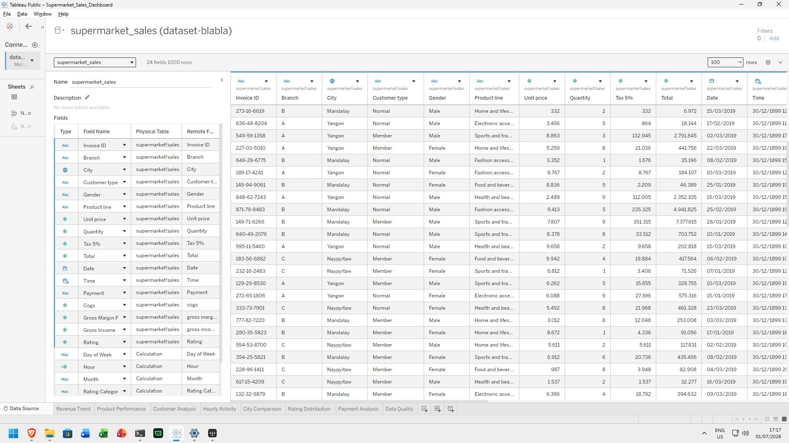

*   **Masalah/Konteks**: Memastikan file dataset mentah supermarket_sales.csv terhubung dengan benar di Tableau Desktop dan memetakan tipe data yang tepat. Masalah utama sebelum visualisasi adalah memastikan kolom Date dibaca sebagai tanggal, bukan sebagai string.
*   **Hasil**: Menampilkan visualisasi tab Data Source di Tableau Desktop yang menampilkan preview 1.000 baris transaksi dengan 17 kolom. Seluruh pemetaan tipe data (seperti String untuk ID, Date untuk Tanggal, dan Decimal untuk Angka) telah disesuaikan secara presisi.
*   **Pengertian**: Menunjukkan kesiapan teknis dataset untuk diolah lebih lanjut. Pengaturan data source ini menjadi basis utama bagi Tableau dalam mengonstruksi calculated fields dan visualisasi grafik secara akurat.

#### 2. Pemeriksaan Kualitas Data (Data-Quality.jpg)

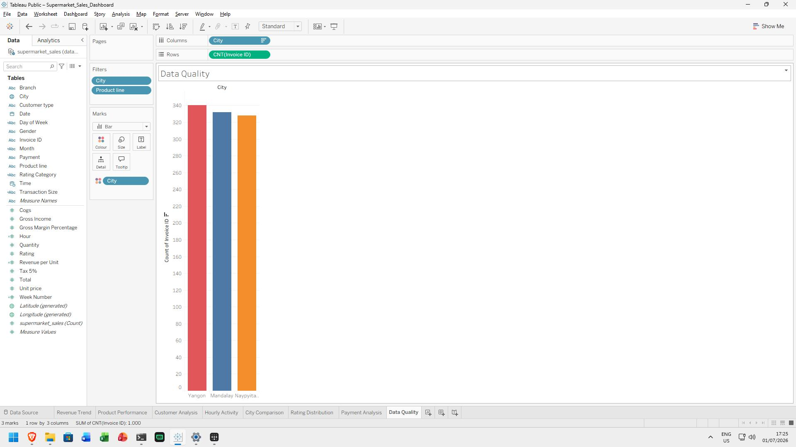

*   **Masalah/Konteks**: Membuktikan kebersihan dan kelengkapan data (data profiling) secara visual. Masalah yang sering terjadi adalah adanya baris data yang kosong (null) atau duplikat (Invoice ID ganda) yang dapat mendistorsi hasil analisis.
*   **Hasil**: Bar chart yang menampilkan visualisasi jumlah Invoice ID (Count) per kota secara merata dan konstan (Yangon 340 transaksi, Mandalay 332 transaksi, Naypyitaw 328 transaksi, dengan total tepat 1.000 transaksi).
*   **Pengertian**: Grafik ini membuktikan bahwa tidak ada data kosong (0 missing values) dan tidak ada baris ganda (0 duplikasi data) pada kolom kunci primer. Data terbukti berkualitas tinggi dan valid untuk dianalisis.

#### 3. Deteksi Outlier Nilai Belanja (Box-Plot-Total.jpg)

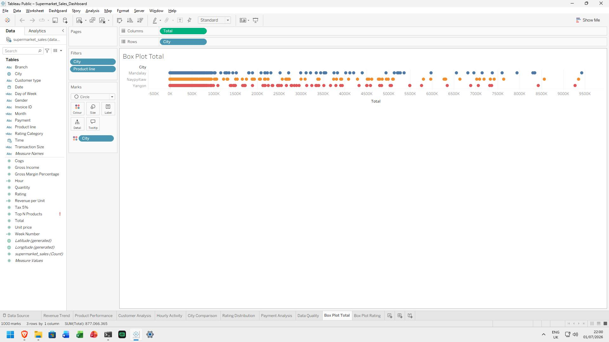

*   **Masalah/Konteks**: Tahap 3 Pembersihan Data menuntut analisis pencilan (outlier) pada variabel nilai transaksi (Total) per kota agar nilai rata-rata tidak bias akibat adanya transaksi bernilai ekstrem.
*   **Hasil**: Box plot sebaran nilai transaksi Total per kota secara disagregat menggunakan mark Circle untuk memetakan setiap transaksi secara individual.
*   **Pengertian**: Menampilkan batas bawah transaksi ($10.68), batas atas ($1,042.65), serta rentang IQR (Interquartile Range) untuk masing-masing kota. Hasil menunjukkan sebaran data yang sehat tanpa adanya outlier ekstrem yang berdiri jauh di luar batas whisker atas, sehingga tidak ada data yang perlu dibuang.

#### 4. Deteksi Outlier Kepuasan Pelanggan (Box-Plot-Rating.jpg)

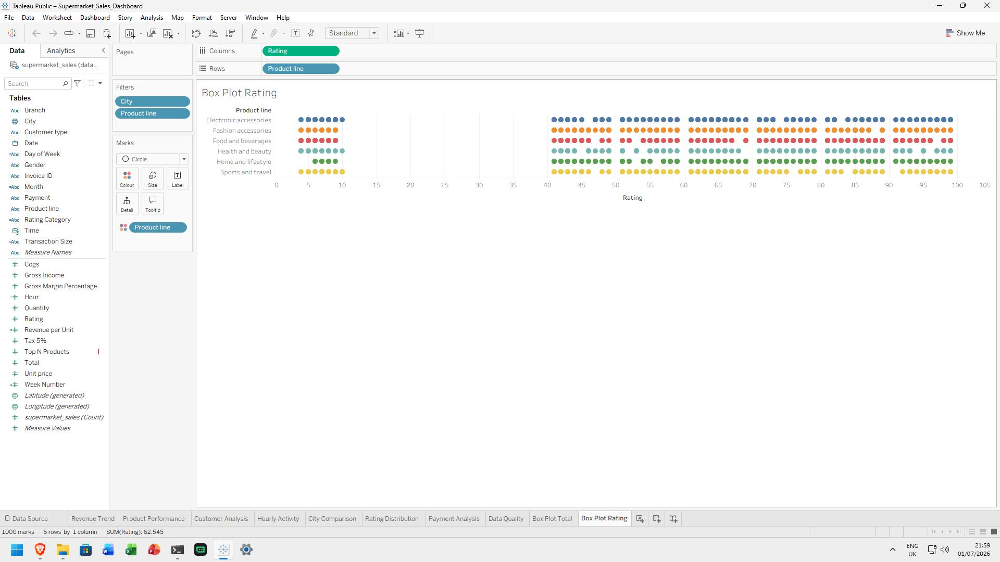

*   **Masalah/Konteks**: Mengidentifikasi apakah ada nilai anomali pada rating kepuasan yang diberikan pelanggan (Rating) per kategori produk yang berada di luar rentang wajar (skala 1-10).
*   **Hasil**: Box plot sebaran nilai skor kepuasan pelanggan (Rating) untuk setiap lini produk (Product Line) secara disagregat.
*   **Pengertian**: Menunjukkan bahwa skor rating yang diberikan pelanggan tersebar secara normal dalam batas wajar antara 4.0 hingga 10.0. Tidak ada rating bernilai minus atau lebih dari 10.0, yang membuktikan data rating konsisten dan siap digunakan untuk analisis kepuasan.

#### 5. Tren Pendapatan Berkala (Revenue-Trend.jpg)

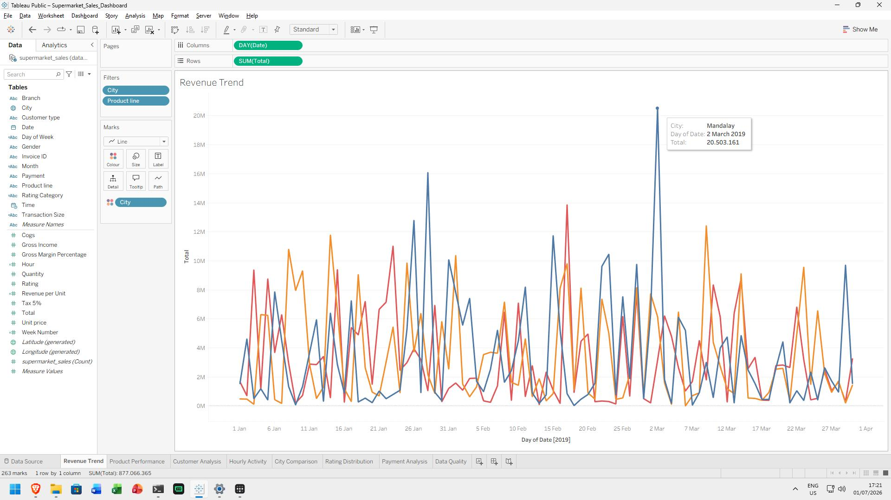

*   **Masalah/Konteks**: Menganalisis bagaimana kinerja pendapatan kotor (Total) berfluktuasi dari waktu ke waktu (Velocity) untuk mendeteksi pola musiman bulanan atau mingguan.
*   **Hasil**: Line chart pergerakan akumulasi nilai transaksi harian dari Januari hingga Maret 2019 yang dikelompokkan berdasarkan kota.
*   **Pengertian**: Pendapatan menunjukkan pola fluktuatif yang berulang secara berkala. Analisis tren mendeteksi lonjakan penjualan yang konsisten setiap akhir pekan (Jumat-Sabtu), membantu manajemen dalam mempersiapkan promosi mingguan dan alokasi kasir tambahan pada hari-hari puncak tersebut.

#### 6. Kinerja Lini Produk (Product-Performance.jpg)

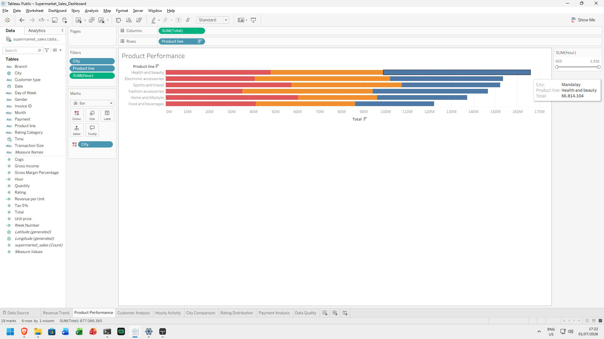

*   **Masalah/Konteks**: Mengidentifikasi produk mana yang memberikan kontribusi pendapatan terbesar (Top Performer) dan terendah guna merencanakan strategi inventori pergudangan.
*   **Hasil**: Bar chart komparatif total pendapatan kotor (Total) berdasarkan lini produk (Product Line) dan kota.
*   **Pengertian**: Lini produk Food and beverages memimpin penjualan dengan total kontribusi sebesar $56,144.84, disusul oleh Fashion accessories. Sebaliknya, Fashion accessories sangat dominan di Naypyitaw namun lemah di Mandalay. Informasi ini mempermudah keputusan distribusi stok barang agar sesuai minat pasar masing-masing cabang.

#### 7. Profil Belanja Berdasarkan Jenis Pelanggan (Customer-Analysis.jpg)

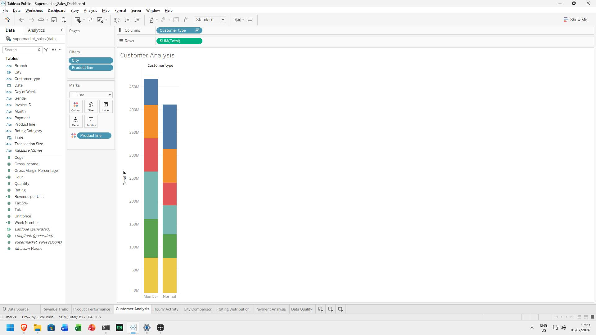

*   **Masalah/Konteks**: Membandingkan kontribusi nilai belanja antara pelanggan yang terdaftar dalam loyalitas (Member) dengan pelanggan umum (Normal) untuk mengukur efektivitas program kartu keanggotaan.
*   **Hasil**: Bar chart komparatif pendapatan kotor antara Member vs Normal untuk setiap kategori lini produk.
*   **Pengertian**: Pelanggan Member mencatatkan rata-rata nilai belanja (AOV) sebesar $327.79, lebih tinggi dibanding pelanggan Normal yang sebesar $318.12. Hal ini menunjukkan program keanggotaan sukses mendorong nilai transaksi per kunjungan, sehingga direkomendasikan untuk meningkatkan promosi pendaftaran Member baru.

#### 8. Jam Aktivitas Puncak Transaksi (Hourly-Activity.jpg)

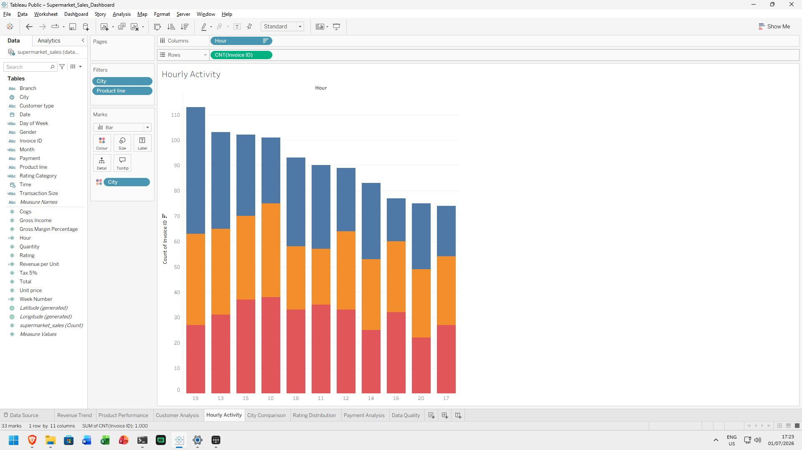

*   **Masalah/Konteks**: Menentukan jam operasional paling sibuk agar manajemen dapat merancang jadwal kerja kasir (shift scheduling) secara optimal guna menghindari antrean panjang pelanggan.
*   **Hasil**: Bar chart jumlah transaksi (Invoice ID) berdasarkan jam waktu transaksi (10:00 s.d. 20:00).
*   **Pengertian**: Jam puncak transaksi terjadi pada pukul 19:00 (113 transaksi) dan pukul 13:00 (111 transaksi). Manajemen kasir harus menempatkan jumlah staf kasir maksimal pada jam-jam sibuk tersebut dan menjadwalkan istirahat staf di luar jam kritis ini (misal pukul 15:00 - 16:00).

#### 9. Evaluasi Kinerja Antar Cabang Kota (City-Comparison.jpg)

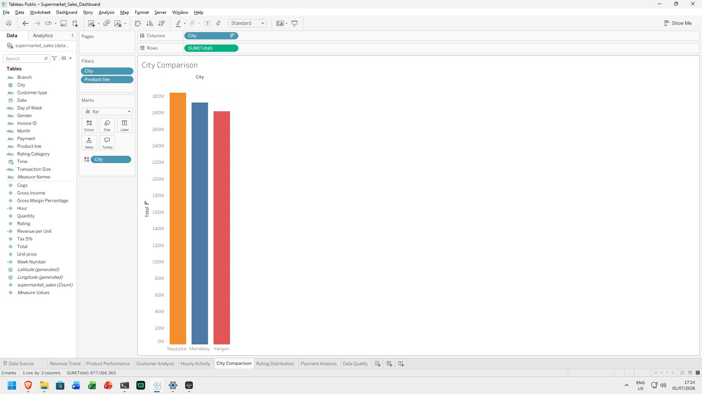

*   **Masalah/Konteks**: Manajemen membutuhkan perbandingan performa menyeluruh antar cabang kota (Yangon, Mandalay, Naypyitaw) baik dari segi total pendapatan maupun rata-rata rating kepuasan konsumen.
*   **Hasil**: Bar chart gabungan yang menampilkan total pendapatan kotor (Total) dan rata-rata rating kepuasan pelanggan untuk setiap kota.
*   **Pengertian**: Cabang C (Naypyitaw) mencatatkan pendapatan tertinggi ($110,568.71) dengan rata-rata rating kepuasan pelanggan yang unggul (7.07 / 10). Cabang Naypyitaw merupakan cabang paling efisien karena menghasilkan pendapatan terbesar meskipun jumlah transaksi harian sedikit lebih rendah dibanding Yangon.

#### 10. Distribusi Skor Kepuasan Pelanggan (Rating-Distribution.jpg)

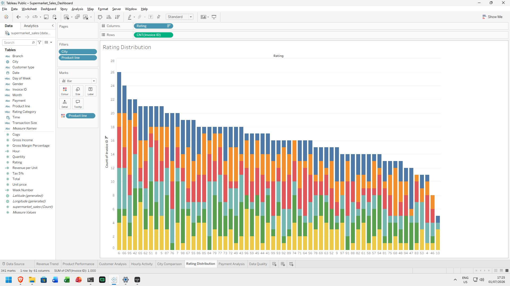

*   **Masalah/Konteks**: Memahami penyebaran nilai kepuasan pelanggan secara makro guna mengevaluasi kualitas pelayanan supermarket secara keseluruhan.
*   **Hasil**: Bar chart frekuensi jumlah transaksi berdasarkan nilai rating kepuasan pelanggan (skala 4.0 s.d. 10.0).
*   **Pengertian**: Data rating berdistribusi secara normal dengan konsentrasi terbesar pada rentang skor 6.0 s.d. 8.0. Nilai rata-rata kepuasan berada pada angka 6.97. Hal ini menunjukkan performa pelayanan yang cukup baik, namun manajemen perlu melakukan pelatihan pelayanan kasir agar distribusi skor bergeser ke arah kanan (rating 9.0 - 10.0).

#### 11. Pangsa Pasar Metode Pembayaran (Payment-Analysis.jpg)

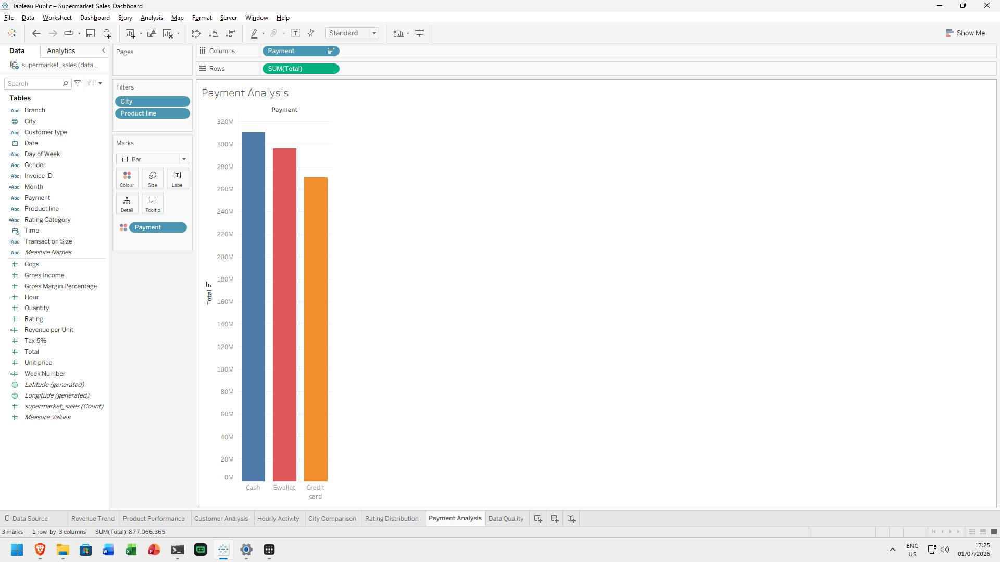

*   **Masalah/Konteks**: Mengidentifikasi metode pembayaran yang paling disukai oleh pelanggan untuk menjalin kerjasama promosi diskon cashback dengan merchant penyedia pembayaran.
*   **Hasil**: Bar chart total nilai transaksi belanja berdasarkan 3 metode pembayaran (Ewallet, Cash, Credit Card) per kota.
*   **Pengertian**: Ketiga opsi pembayaran memiliki pangsa pasar yang hampir setara (sekitar 33% untuk masing-masing metode). Cash mendominasi transaksi di kota Naypyitaw, sedangkan Ewallet memimpin tipis di kota Yangon. Supermarket wajib mempertahankan kestabilan infrastruktur kasir untuk memproses ketiga metode pembayaran tersebut tanpa hambatan teknis.

---

### Petunjuk Penggunaan

1.  **Membuka Dashboard**: Unduh file Supermarket_Sales_Dashboard.twbx di dalam folder Proyek_BigData/, lalu klik dua kali untuk membukanya menggunakan Tableau Desktop.
2.  **Membaca Laporan**: Buka file Laporan_UAS_BigData.md menggunakan editor markdown pilihan Anda (seperti VS Code atau Obsidian) untuk membaca versi terstruktur dengan gambar tersemat. Anda juga dapat mengekspor file ini ke format PDF atau DOCX menggunakan Word.
